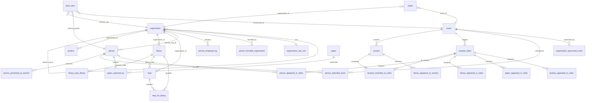

# Knowledge graph: entities and relationships

This document is derived from `types/database.types.ts` (Supabase-generated types). It describes **research-relevant** tables: people, organizations, conferences, sessions, media, libraries, repos, papers, products, news, and how they connect. Use it when querying the database, designing RAG context, or instructing agents.

Canonical **entity-kind strings** for polymorphic columns (`saved_items`, `notes`, `image_attachment`, `profile_followed_entity`, etc.) live in `lib/schema/entity-kind.ts` (`ENTITY_KINDS`, `FOLLOW_ENTITY_KINDS`, `ARTIFACT_KINDS`).

---

## Identifier cheat sheet

| Entity | Primary key column | Stable public key | Notes |
|--------|-------------------|-------------------|--------|
| Person | `person_id` (UUID) | `slug` | |
| Organization | `organization_id` (UUID) | `slug` | Self-parent via `parent_org_id` |
| Event (conference) | `event_id` (UUID) | `slug` | |
| Session (talk) | `session_id` (UUID) | `slug` | |
| YouTube video | `video_id` (string, YouTube id) | `slug` | Also optional `event_id` |
| Library | (no separate id in types beyond slug usage) | **`slug`** | FKs from junction tables use `slug` |
| Product | implied row id via slug refs | **`slug`** | Row includes `organization_id` |
| Paper | implied via slug refs | **`slug`** | |
| Repo | (row identified by `slug`) | **`slug`** | `github_org` / `github_repo` also |
| News | `news_item_id` (UUID) | **`slug`** | Rich denormalized relation arrays |
| Report | `report_id` (UUID) | **`slug`** | |

Agents should prefer **`slug`** for URL-safe joins to `library` / `paper` / `product` junction tables; use **UUID `*_id`** for person, organization, event, session, and most FK-backed edges.

---

## 1. Person (`person`)

**Role:** Public knowledge-graph profile (speaker, founder, engineer)—distinct from app user `profiles`.

**Key columns:** `person_id`, `slug`, `full_name`, `primary_org_id`, role/expertise fields, social URLs, `embedding`, `search_text`, `metadata`.

**Foreign keys:**

- `primary_org_id` → `organization.organization_id` (optional “home” org).

**Outgoing edges (junction / usage):**

- `person_presented_at_session` — (person_id, session_id) speaker at a session.
- `person_attended_event` — (person_id, event_id, `role`, optional `affiliation_org` → `organization.organization_id`).
- `person_employed_by` — (person_id, organization_id) employment; optional `confidence`, `needs_review`, `role_title`.
- `person_founded_organization` — founder link; same review fields.
- `organization_has_ceo` — (organization_id, person_id) **one-to-one per org** (`isOneToOne: true` on org side): CEO attribution.
- `paper_authored_by` — (paper_slug, person_id, `ord`, `is_corresponding`, optional `affiliation_org` → organization).
- `person_appeared_in_video` — (person_id, video_id) appearance in a recording.
- `news_item.primary_person_id` → person (story subject).

**App user overlap:** `profiles` is the authenticated user; optional `current_org_id` → `organization`. Not the same table as `person`, but both can reference organizations.

---

## 2. Organization (`organization`)

**Role:** Company, lab, or other org in the ecosystem graph.

**Key columns:** `organization_id`, `slug`, `name`, funding/stage/headquarters, `parent_org_id` (subsidiary tree), flags (`is_ai_first`, `is_aie_sponsor`, …), `embedding`, `search_text`, `metadata`.

**Foreign keys:**

- `parent_org_id` → `organization.organization_id` (self-referential hierarchy).

**Outgoing / incoming edges:**

- **Products:** `product.organization_id` → organization.
- **Libraries:** `library.organization_id` → organization (maintainer/publisher).
- **Repos:** `repo.organization_id` → optional org attribution.
- **People:** `person.primary_org_id`; `person_employed_by`; `person_founded_organization`; `organization_has_ceo`; `person_attended_event.affiliation_org`; `paper_authored_by.affiliation_org`.
- **Events:** `organization_sponsored_event` — sponsor tiers, amounts.
- **News:** `news_item.primary_org_id`; denormalized `related_org_slugs[]`.
- **Reports:** `report.organization_id`; `report.cited_org_ids[]`.
- **Profiles:** `profiles.current_org_id`.

---

## 3. Event vs session vs video (“conference → talk → recording”)

### Event (`event`)

**Role:** Conference or multi-day gathering (not a calendar “score_event”).

**Key columns:** `event_id`, `slug`, `name`, dates, venue/geo, `series`, `edition`, `topic_tags[]`, `is_aie_official`, playlist URL, counts (`session_count`, `speaker_count`), `embedding`, `fts`.

**Relationships:** No FK parents. Children:

- `session.event_id` — talks belonging to the event.
- `youtube_video.event_id` — videos tagged with the event.
- `person_attended_event`, `organization_sponsored_event`, `news_item.announced_at_event_id`, `report.event_id`.

### Session (`session`)

**Role:** Scheduled talk / workshop row (agenda slot).

**Key columns:** `session_id`, `slug`, `event_id`, title/description, `scheduled_at`, `room`, `track`, `session_format`, `language`, `tags[]`, `domain_layer`, links (`slides_url`, `code_repo_url`), `embedding`.

**Foreign keys:**

- `event_id` → `event` (optional: orphan sessions possible in schema).

**Edges:**

- **Speakers:** `person_presented_at_session`.
- **Libraries mentioned:** `library_appeared_in_session` — (`library_slug`, `session_id`, `confidence`, `evidence` JSON).

### YouTube video (`youtube_video`) and channel (`youtube_channel`)

**Role:** Any indexed video; often the **recording** of a session or standalone talk.

**Key columns:** `video_id`, `slug`, `channel_id`, `event_id`, transcript/summary status, engagement stats, `embedding`, `tags[]`, `domain_layer`.

**Foreign keys:**

- `channel_id` → `youtube_channel.channel_id`.
- `event_id` → `event`.

**Bridge session ↔ video:**

- `session_recorded_as_video` — (`session_id`, `video_id`). Types mark **`session_id` as one-to-one** in this join: at most one link row per session (typical pattern: one canonical recording per talk).

**Mention / appearance junctions (video as hub):**

- `person_appeared_in_video`
- `library_appeared_in_video` (by `library_slug`)
- `paper_appeared_in_video` (by `paper_slug`)
- `product_appeared_in_video` (by `product_slug`)

---

## 4. Product (`product`)

**Role:** Commercial or open product (often tied to a vendor org).

**Key columns:** `slug`, `name`, `organization_id`, `kind`, pricing URLs, `is_flagship`, `categories[]`, `tags[]`, `domain_layer`, `embedding`.

**Foreign keys:**

- `organization_id` → `organization` (optional).

**Edges:** `product_appeared_in_video`; `news_item.related_product_slugs[]`.

---

## 5. Library (`library`) and repo (`repo`)

### Library

**Role:** Framework, SDK, model hub entry, or similar **logical** package (may aggregate multiple GitHub repos).

**Key columns:** `slug`, `name`, `organization_id`, package ids (`npm_name`, `pypi_name`, `huggingface_id`), GitHub stats, `tags[]`, `kind`, `is_open_source`, `embedding`, `search_text`.

**Foreign keys:**

- `organization_id` → `organization` (optional).

**Edges:**

- **Depends on library:** `library_uses_library` — (`parent_library_slug`, `child_library_slug`, `dep_kind`).
- **Session / video mentions:** `library_appeared_in_session`, `library_appeared_in_video`.
- **News / reports:** `news_item.related_library_slugs[]`, `report.cited_library_slugs[]`.
- **Repos:** `repo.library_slug` → library; `repo_for_library` — (`library_slug`, `repo_slug`, `role`) many-to-many with role.

### Repo

**Role:** Concrete GitHub repository.

**Key columns:** `slug`, `github_org`, `github_repo`, `github_url`, `library_slug`, `organization_id`, stars/forks/topics, `metadata`.

**Foreign keys:**

- `library_slug` → `library.slug` (optional association).
- `organization_id` → `organization` (optional).

---

## 6. Paper (`paper`)

**Role:** Research publication (arXiv DOI, etc.).

**Key columns:** `slug`, `title`, `abstract`, `authors` (JSON), `arxiv_id`, `doi`, `url`, `pdf_url`, `venue`, `published_on`, `citation_count`, `categories[]`, `tags[]`, `domain_layer`, `embedding`.

**Relationships:** No FK on the table body; authorship is normalized:

- `paper_authored_by` — (`paper_slug`, `person_id`, `ord`, `is_corresponding`, optional `affiliation_org` → `organization_id`).
- `paper_appeared_in_video` — paper discussed in a video.
- `news_item.related_paper_slugs[]`, `report.cited_paper_slugs[]`.

---

## 7. News / story (`news_item`)

**Role:** Timely article or digest item; **stories and “news” share this table**—discriminate with `kind`, `categories[]`, `tags[]`.

**Key columns:** `news_item_id`, `slug`, `title`, `headline`, `summary`, `body_md`, `published_at`, `occurred_on`, `importance`, `status`, funding fields, `model_params_b`, `hero_image_url`, `embedding`, `search_text`.

**Foreign keys (strong):**

- `primary_org_id` → `organization`
- `primary_person_id` → `person`
- `announced_at_event_id` → `event`

**Denormalized / soft graph (no FK enforcement on arrays):**

- `related_person_slugs[]`, `related_org_slugs[]`, `related_library_slugs[]`, `related_product_slugs[]`, `related_paper_slugs[]`, `related_video_ids[]` (YouTube ids).

Use arrays for **broad linking** and junction tables for **evidence-weighted** video/session mentions.

---

## 8. Report (`report`)

**Role:** Longer editorial or research **report** content (markdown body, citations).

**Key columns:** `report_id`, `slug`, `report_kind`, `title`, `body_md`, `summary`, `authors` (JSON), `organization_id`, `event_id`, `published_at`, `status`, `tags[]`, `domain_layer`, `embedding`.

**Citation arrays (soft refs):** `cited_library_slugs[]`, `cited_paper_slugs[]`, `cited_video_ids[]`, `cited_org_ids[]`.

**Foreign keys:** `organization_id`, `event_id`.

---

## 9. Cross-cutting: chunks, images, learning assets

### Chunk (`chunk`)

Vector / FTS **segments** of upstream content.

- Columns: `chunk_id`, `source_id`, **`source_kind`** (polymorphic string), `content`, `ord`, `embedding`, `metadata`.
- **No FK** in types—integrity is application-level. Typical `source_kind` values align with corpus types (see `ARTIFACT_KINDS` in `entity-kind.ts`).

### Image (`image`) and `image_attachment`

- `image_attachment` links (`entity_id`, **`entity_kind`**, `image_id`, `role`, `ord`) to any whitelisted entity surface.

### Learning asset (`learning_asset`)

Stored files / extracts (slides, PDFs) used by learning flows; **`asset_kind`**, storage paths, extraction pipeline fields. No FK to the graph in types.

---

## 10. User behavior graph (for recommendations, not ontology)

These tables use **`entity_kind` + `entity_id`** (see `RECOMMENDABLE_ENTITY_KINDS` in `lib/recommendations/types.ts`: `person`, `organization`, `library`, `paper`, `session`, `youtube_video`—note **product** and **event** are in the wider `ENTITY_KINDS` but not in the default recommendable list).

| Table | Purpose |
|-------|---------|
| `saved_items` | Bookmarks (`entity_type` + `entity_id`) |
| `profile_followed_entity` | Follow graph (can include `category` / `domain_layer`) |
| `entity_interaction_event` | Interaction queue for rec pipelines |
| `user_entity_recommendation` | Precomputed rec rows per user |

---

## 11. Learning / gamification (separate product vertical)

Tables: `course`, `course_module`, `course_enrollment`, `challenge`, `attempt`, `module_completion`, `module_uses_artifact`, `score_event`, etc. They compose **curricula and coding challenges**; `module_uses_artifact` points at corpus artifacts (`artifact_kind` per `ARTIFACT_KINDS`) including `paper`, `library`, `session`, `video`, `news_item`, `chunk`, etc.

---

## Relationship diagram (Mermaid)

---

## Agent tips

1. **Traverse talks:** `event` → `session` → `person_presented_at_session` → `person`; optional `session_recorded_as_video` → `youtube_video` → mention tables.
2. **Traverse ecosystem around a library:** `library` → `repo` / `repo_for_library` → `organization`; reverse via `library_appeared_in_*` into sessions and videos.
3. **News without extra joins:** scan `related_*` arrays and `primary_*` FKs together—arrays may reference entities not yet imported.
4. **Recommendations:** use `entity_kind` / `entity_id` consistently with `lib/schema/entity-kind.ts` and recommendation types.
5. **Regenerated types:** After migrations, regenerate `database.types.ts`; this doc should be updated if new junction tables or FKs appear.

---

*Last aligned with `types/database.types.ts` in the repository; line-level definitions may drift after `supabase gen types`.*
